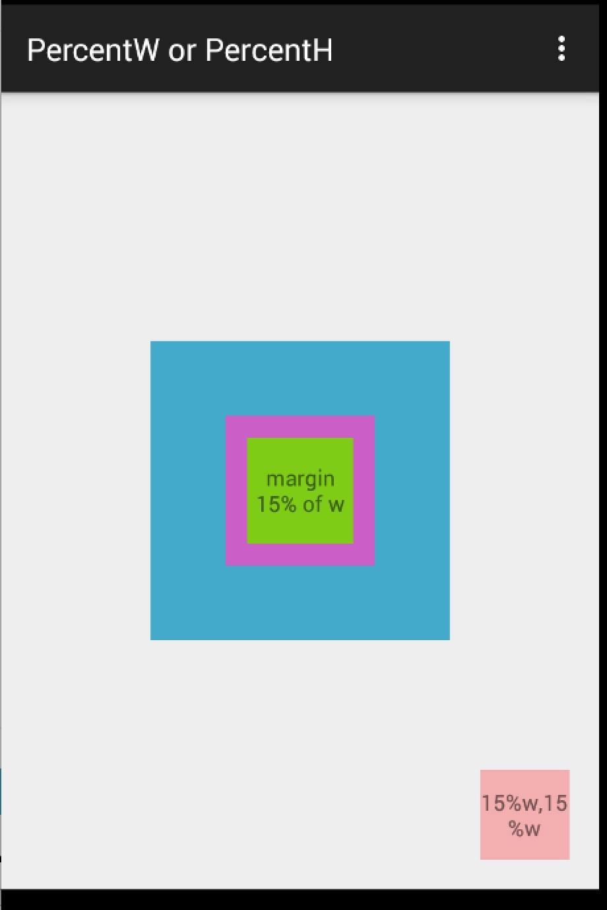
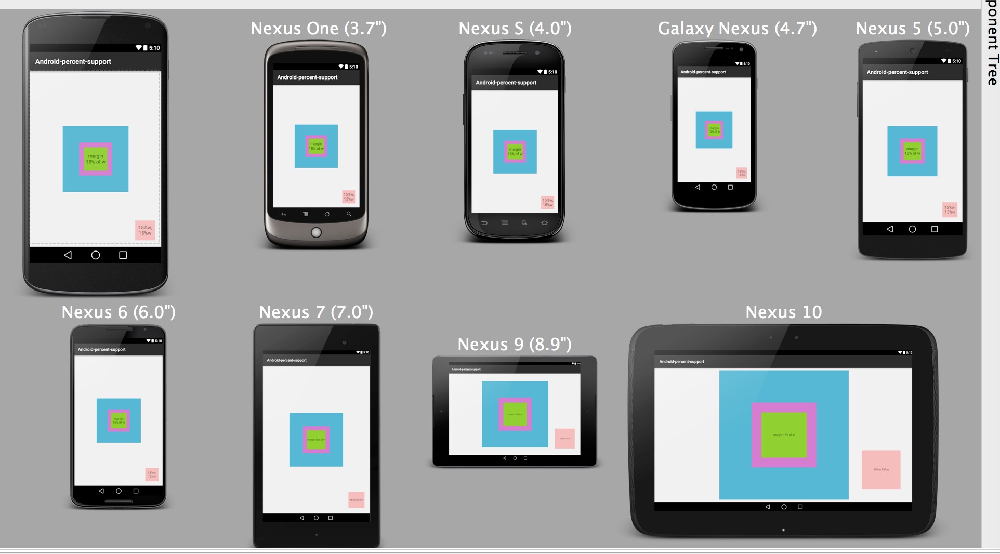
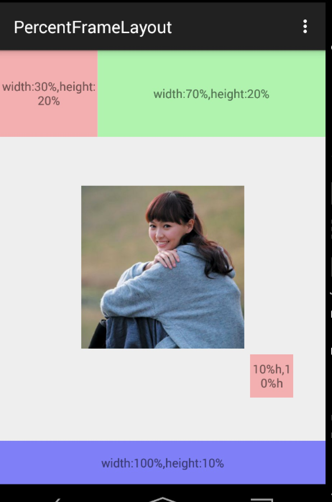
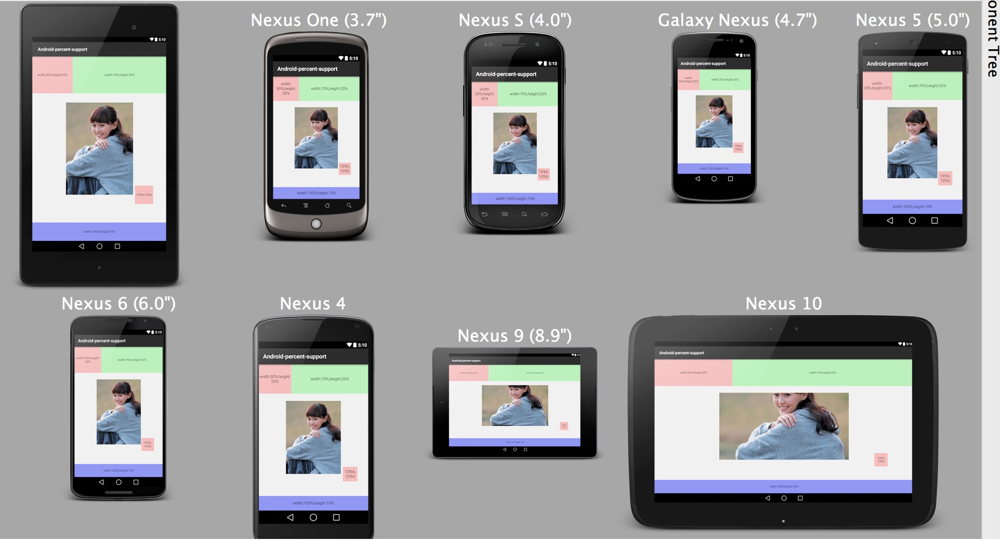
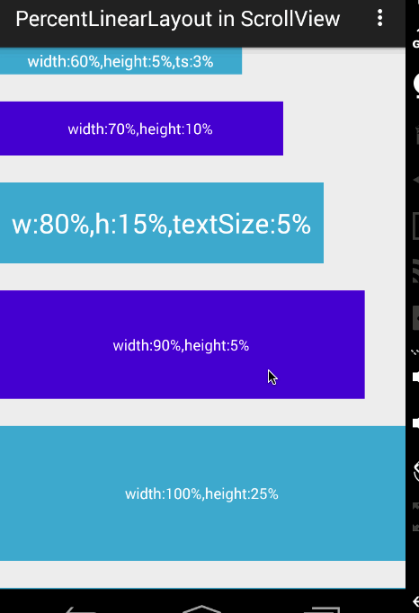

# android-percent-support-extend

>对于android-percent-support的扩展库。

目前支持：

1. 不改变原有库的用法
2. 添加了`PercentLinearLayout `
3. 支持宽度高度百分比设置值
4. 支持margin百分比设置值
5. 支持padding百分比设置值
6. 支持minWidth , maxWidth , minHeight , maxHeight百分比设置值
4. 支持TextView、Button、EditText的textSize
5. 支持ScrollView内部为Linearlayout

目前最新版本为，尽可能使用最新版本，源码和demo在github中： 

```xml
compile 'com.zhy:percent-support-extends:1.0.6'
```

## 一 扩展的功能


对于官方库，做了如下的改变：

1. 不改变原有库的用法
2. 添加了`PercentLinearLayout `
3. 支持百分比指定特定的参考值，比如宽度或者高度。
	
	例如：
	
	```xml
	app:layout_heightPercent="50%w"
	app:layout_marginPercent="15%w"
	app:layout_marginBottomPercent="20%h"
	```
4. 支持通过app:layout_textSizePercent设置textView（button,editText）的textSize
	
	例如：
	
	```xml
	 <TextView
          app:layout_textSizePercent="3%h"
     />
	```

5. 对于外层套ScrollView的问题，目前可以在`PercentLinearLayout `的外层使用ScrollView，不过对于宽度的百分比参考的就是android.R.id.content的高度(因为，无法参考父控件的高度，父控件的高度理论上依赖于子View高度，且模式为UNSPECIFIED)。
6. 支持minWidth,maxWidth,minHeight,maxHeight的支持。

	例如：
	
	```xml
	app:layout_maxWidthPercent
	app:layout_maxHeightPercent
	app:layout_minWidthPercent
	app:layout_minWidthPercent
	```
	（注：用法和maxHeight等一致，如果使用：值会覆盖原本的maxHeight等属性）。
7. 支持padding百分比设置值	
	
	例如：
	
	```xml
	app:layout_paddingBottomPercent="8%w"
    app:layout_paddingLeftPercent="2%w"
    app:layout_paddingRightPercent="4%w"
    app:layout_paddingTopPercent="6%w"
	```

	

## 二 为什么要扩展这个库

首先我们回顾下百分比布局库的用法，提供了`PercentRelativeLayout`、`PercentFrameLayout`供大家在编写的时候，对于以下属性：

`layout_widthPercent`、`layout_heightPercent`、 
`layout_marginPercent`、`layout_marginLeftPercent`、 
`layout_marginTopPercent`、`layout_marginRightPercent`、 
`layout_marginBottomPercent`、`layout_marginStartPercent`、`layout_marginEndPercent`。

可以使用百分比进行设置宽、高、边距，的确给我们在适配上提供了极大的便利，但是在使用过程中，觉得存在一些场景无法得到满足。什么场景呢？下面我举几个例子。

1. 当使用图片时，无法设置宽高的比例
	
	比如我们的图片宽高是200*100的，我们在使用过程中我们设置宽高为20%、10%，这样会造成图片的比例失调。为什么呢？因为20%参考的是屏幕的宽度，而10%参考的是屏幕的高度。
	
2. 很难使用百分比定义一个正方形的控件
	
	比如，我现在界面的右下角有一个`FloatingActionButton `，我希望其宽度和高度都为屏幕宽度的10%，很难做到。
	
3. 一个控件的margin四个方向值一致
	
	有些时候，我设置margin，我希望四边的边距一致的，但是如果目前设置5%，会造成，上下为高度的5%，左右边距为宽度的5%。
	
综合上述这些问题，可以发现目前的percent-support-lib并不能完全满足我们的需求，所以我们考虑对其进行扩展。说白了，我们就希望在布局的时候可以自己设定参考看度还是高度，比如上述2，我们对于宽高可以写成10%w，10%w。也就是在不改变原库的用法的前提下，添加一些额外的支持。


	
## 三 用法
	
### Android Studio

对于如何导入，也是相当的简单，android studio的用户，直接：

```xml
dependencies {
    //...
    compile 'com.zhy:percent-support-extends:1.0.6'
}

```
不需要导入官方的percent-support-lib了。

对于的三个类分别为：

```xml
com.zhy.android.percent.support.PercentLinearLayout
com.zhy.android.percent.support.PercentRelativeLayout
com.zhy.android.percent.support.PercentFrameLayout
```

###支持的属性 :

- layout_heightPercent
- layout_widthPercent
- layout_marginBottomPercent
- layout_marginEndPercent
- layout_marginLeftPercent
- layout_marginPercent
- layout_marginRightPercent 
- layout_marginStartPercent
- layout_marginTopPercent
- layout_textSizePercent
- layout_maxWidthPercent
- layout_maxHeightPercent
- layout_minWidthPercent
- layout_minHeightPercent
- layout_paddingPercent
- layout_paddingTopPercent
- layout_paddingBottomPercent
- layout_paddingLeftPercent
- layout_paddingRightPercent

对于值可以取：10%w , 10%h , 10% 

### Eclispe 

对于eclipse的用户：下载完项目后，导入[eclipse\_demo\_and\_sources](eclipse_demo_and_sources)中的`android-percent-support-extend-sample`，将`android-percent-support-extend-lib`以library方式引入。

注意:eclipse的版本并非最新版本。


## 四 具体的示例

#### Demo 1





xml:

```xml
<?xml version="1.0" encoding="utf-8"?>


<com.zhy.android.percent.support.PercentFrameLayout
    xmlns:android="http://schemas.android.com/apk/res/android"
    xmlns:app="http://schemas.android.com/apk/res-auto"
    android:layout_width="match_parent"
    android:layout_height="match_parent"
    android:orientation="vertical">

    <com.zhy.android.percent.support.PercentFrameLayout
        android:layout_width="0dp"
        android:layout_height="0dp"
        android:layout_gravity="center"
        android:background="#ff44aacc"
        app:layout_heightPercent="50%w"
        app:layout_widthPercent="50%w">

        <com.zhy.android.percent.support.PercentFrameLayout
            android:layout_width="0dp"
            android:layout_height="0dp"
            android:layout_gravity="center"
            android:background="#ffcc5ec7"
            app:layout_heightPercent="50%w"
            app:layout_widthPercent="50%w">

            <TextView
                android:layout_width="match_parent"
                android:layout_height="match_parent"
                android:layout_gravity="center"
                android:background="#ff7ecc16"
                android:gravity="center"
                android:text="margin 15% of w"
                app:layout_marginPercent="15%w"
                />

        </com.zhy.android.percent.support.PercentFrameLayout>

    </com.zhy.android.percent.support.PercentFrameLayout>

    <TextView android:layout_width="0dp"
              android:layout_height="0dp"
              android:layout_gravity="bottom|right"
              android:background="#44ff0000"
              android:gravity="center"
              android:text="15%w,15%w"
              app:layout_heightPercent="15%w"
              app:layout_marginPercent="5%w"
              app:layout_widthPercent="15%w"/>


</com.zhy.android.percent.support.PercentFrameLayout>

```

#### Demo 2






xml:

```xml
<?xml version="1.0" encoding="utf-8"?>
<com.zhy.android.percent.support.PercentFrameLayout
    xmlns:android="http://schemas.android.com/apk/res/android"
    xmlns:app="http://schemas.android.com/apk/res-auto"
    android:layout_width="match_parent"
    android:layout_height="match_parent">

    <TextView
        android:id="@+id/id_test"
        android:layout_width="0dp"
        android:layout_height="0dp"
        android:layout_gravity="left|top"
        android:background="#44ff0000"
        android:gravity="center"
        android:onClick="test1"
        android:text="width:30%,height:20%"
        app:layout_heightPercent="20%"
        app:layout_widthPercent="30%"/>

    <TextView
        android:layout_width="0dp"
        android:layout_height="0dp"
        android:layout_gravity="right|top"
        android:background="#4400ff00"
        android:gravity="center"
        android:text="width:70%,height:20%"
        app:layout_heightPercent="20%"
        app:layout_widthPercent="70%"/>


    <TextView
        android:layout_width="0dp"
        android:layout_height="0dp"
        android:layout_gravity="bottom"
        android:background="#770000ff"
        android:gravity="center"
        android:text="width:100%,height:10%"
        app:layout_heightPercent="10%"
        app:layout_widthPercent="100%"/>


    <ImageView
        android:layout_width="wrap_content"
        android:layout_height="wrap_content"
        android:layout_gravity="center"
        android:scaleType="centerCrop"
        android:src="@drawable/tangyan"
        app:layout_heightPercent="50%h"
        app:layout_widthPercent="50%w"/>

    <TextView
        android:layout_width="0dp"
        android:layout_height="0dp"
        app:layout_heightPercent="10%h"
        app:layout_widthPercent="10%h"
        android:text="10%h,10%h"
        android:gravity="center"
        android:layout_gravity="bottom|right"
        android:background="#44ff0000"
        app:layout_marginBottomPercent="20%h"
        app:layout_marginRightPercent="10%"/>


</com.zhy.android.percent.support.PercentFrameLayout>


```

ok，例子都比较简单，主要就一个布局文件，可以看出上述我们可以给宽度、高度，边距等指定参考值为宽度或者高度。这样的话，在保证图片宽、高比例、控件设置为正方形等需求就没问题了。

<hr/>

接下来还有个例子，功能主要是设置TextView对于textSize的百分比设置；以及对于ScrollView的支持。当然了，对于ScrollView的支持，这个理论上是不支持的，因为大家都清楚，如果`PercentLinearLayout`在ScrollView中，那么高度的模式肯定是`UNSPECIFIED`，那么理论上来说高度是无限制的，也就是依赖于子View的高度，而百分比布局的高度是依赖于父View的高度的，所有是互斥的。而我们支持是：考虑到编写代码的时候，大多参考的是屏幕高度（android.R.id.content）的高度，所以如果在ScrollView中，编写10%h，这个百分比是依赖于屏幕高度的（不包括ActionBar的高度）。

#### Demo 3



xml:

```xml
<?xml version="1.0" encoding="utf-8"?>

<ScrollView
    xmlns:android="http://schemas.android.com/apk/res/android"
    xmlns:app="http://schemas.android.com/apk/res-auto"
    android:layout_width="match_parent"
    android:layout_height="match_parent">
    <com.zhy.android.percent.support.PercentLinearLayout
        xmlns:android="http://schemas.android.com/apk/res/android"
        xmlns:app="http://schemas.android.com/apk/res-auto"
        android:layout_width="match_parent"
        android:layout_height="wrap_content"
        android:orientation="vertical">

        <TextView
            android:layout_width="0dp"
            android:layout_height="0dp"
            android:background="#ff44aacc"
            android:gravity="center"
            android:text="width:60%,height:5%,ts:3%"
            android:textColor="#ffffff"
            app:layout_heightPercent="5%"
            app:layout_marginBottomPercent="5%"
            app:layout_textSizePercent="3%"
            app:layout_widthPercent="60%"/>

        <TextView
            android:layout_width="0dp"
            android:layout_height="0dp"
            android:background="#ff4400cc"
            android:gravity="center"
            android:text="width:70%,height:10%"
            android:textColor="#ffffff"
            app:layout_heightPercent="10%"
            app:layout_marginBottomPercent="5%"
            app:layout_widthPercent="70%"/>
        <TextView
            android:layout_width="0dp"
            android:layout_height="0dp"
            android:background="#ff44aacc"
            android:gravity="center"
            android:text="w:80%,h:15%,textSize:5%"
            android:textColor="#ffffff"
            app:layout_heightPercent="15%"
            app:layout_marginBottomPercent="5%"
            app:layout_textSizePercent="5%"
            app:layout_widthPercent="80%"/>
        <TextView
            android:layout_width="0dp"
            android:layout_height="0dp"
            android:background="#ff4400cc"
            android:gravity="center"
            android:text="width:90%,height:5%"
            android:textColor="#ffffff"
            app:layout_heightPercent="20%"
            app:layout_marginBottomPercent="5%"
            app:layout_widthPercent="90%"/>

        <TextView
            android:layout_width="match_parent"
            android:layout_height="0dp"
            android:background="#ff44aacc"
            android:gravity="center"
            android:text="width:100%,height:25%"
            android:textColor="#ffffff"
            app:layout_heightPercent="25%"
            app:layout_marginBottomPercent="5%"
            />

        <TextView
            android:layout_width="match_parent"
            android:layout_height="0dp"
            android:background="#ff44aacc"
            android:gravity="center"
            android:text="width:100%,height:30%"
            android:textColor="#ffffff"
            app:layout_heightPercent="30%"
            app:layout_marginBottomPercent="5%"
            />


    </com.zhy.android.percent.support.PercentLinearLayout>
</ScrollView>


```

上面的第三个TextView的字体设置的就是5%（默认参考容器高度）。整个PercentLinearLayout在ScrollView中。ok~ 姑且这样，由于源码比较简单，大家可以根据自己的实际需求去修改，前提尽可能不要改变原有的功能。


## About me

* [博客](http://blog.csdn.net/lmj623565791)
* [新浪微博](http://weibo.com/u/3165018720)
*  email: 623565791@qq.com
* >微信公众号：hongyangAndroid
（欢迎关注，第一时间推送博文信息）


<hr/>

==> 接下来是原库的用法：


Android Percent Support Lib Sample :triangular_ruler::triangular_ruler::triangular_ruler:
===================================
[](https://android-arsenal.com/details/3/2054)

I made a sample of the new percent support library.<br>
It will be documented soon on android dev website so it's just a proof of concept :)<br>
You can check official docs reference [here](https://juliengenoud.github.io/android-percent-support-lib-sample/) 

This library provide percentage based layouts,
horizontal and vertical at the same time.

## simple result

## complex result

<br>from https://gist.github.com/shekarshine/5458f697c02e5619b0e2


### How to use :
just add percent support library to your project
```xml
dependencies {
    compile 'com.android.support:percent:22.2.0'
}
```

###Supported Layouts :

####PercentRelativeLayout
```xml
<android.support.percent.PercentRelativeLayout
    xmlns:android="http://schemas.android.com/apk/res/android"
    xmlns:app="http://schemas.android.com/apk/res-auto"
    android:layout_width="match_parent"
    android:layout_height="match_parent">
    
    <View
        android:id="@+id/top_left"
        android:layout_width="0dp"
        android:layout_height="0dp"
        android:layout_alignParentTop="true"
        android:background="#ff44aacc"
        app:layout_heightPercent="20%"
        app:layout_widthPercent="70%" />

    <View
        android:id="@+id/top_right"
        android:layout_width="0dp"
        android:layout_height="0dp"
        android:layout_alignParentTop="true"
        android:layout_toRightOf="@+id/top_left"
        android:background="#ffe40000"
        app:layout_heightPercent="20%"
        app:layout_widthPercent="30%" />


    <View
        android:id="@+id/bottom"
        android:layout_width="match_parent"
        android:layout_height="0dp"
        android:layout_below="@+id/top_left"
        android:background="#ff00ff22"
        app:layout_heightPercent="80%" />
</android.support.percent.PercentRelativeLayout>
```

####PercentFrameLayout
```xml
<android.support.percent.PercentFrameLayout
    xmlns:android="http://schemas.android.com/apk/res/android"
    xmlns:app="http://schemas.android.com/apk/res-auto"
    android:layout_width="match_parent"
    android:layout_height="match_parent">
        <!-- ... XML CODE -->
</android.support.percent.PercentFrameLayout>
```

###Stylable :

- heightPercent
- widthPercent
- marginBottomPercent
- marginEndPercent
- marginLeftPercent
- marginPercent
- marginRightPercent 
- marginStartPercent
- marginTopPercent

Pre-requisites
--------------

- Android SDK v22
- Android Build Tools v22.0.1
- Android Percent Support Repository v22.2.0
- Android Support v4 Repository v22.2.0

according to the the manifest minsdk is v7 (android 2.1) 

####License Mit
