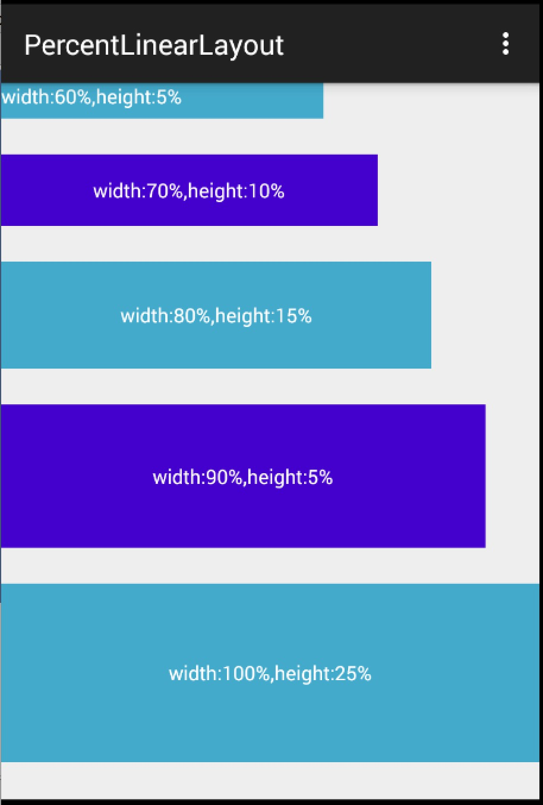

# android-percent-support-extend
>a extends lib for android-percent-support
>
>对于android-percent-support的扩展库。

contains project for android studio and eclipse . 

上面包含as和ec的项目，自行导入。

* support for android-percent-support's orgin abilities 
* 支持该库的原有功能，且用法不变
* add PercentLinearLayout
* 添加了PercentLinearLayout
* support for all attrs use fraction value  based on specified width or height.
* 支持百分比指定特定的参考值，比如宽度或者高度。
* support for use app:layout_textSizePercent for textSize of textView
 	
	>such as `app:layout_heightPercent="50%w"`,
`app:layout_marginPercent="15%w"`,
`app:layout_marginBottomPercent="20%h"`.
* 支持通过app:layout_textSizePercent设置textView的textSize


we not only support fraction value , but also we support use fraction value based on width or height  , such as 10% , 10%w , 10%h 。 

不仅支持百分比设置布局的值，并且可以指定百分比参考的是宽度还是高度。如果不指定宽度和高度，则默认和原本的库效果一致。

Why I Why extend this library ?

为什么要扩展你这个库？

Because , there are some views in my layout are square , such as FloatingActionButton , i wanna its' width and height both are 15% of width ， since I add this ability , so that I can define as below :

因为，在我的布局中有部分View是正方形的大小，比如FloatingActionButton，我希望它的高度和宽度都是宽度的15%，因此我添加了该功能，以至于我可以按照下面的写法编写：

```
   <android.support.percent.PercentFrameLayout
            android:layout_width="0dp"
            android:layout_height="0dp"
            android:layout_gravity="center"
            android:background="#ffcc5ec7"
            app:layout_heightPercent="50%w"
            app:layout_widthPercent="50%w">

            <TextView
                android:layout_width="match_parent"
                android:layout_height="match_parent"
                android:layout_gravity="center"
                android:background="#ff7ecc16"
                android:gravity="center"
                android:text="margin 15% of w"
                app:layout_marginPercent="15%w"
                />

        </android.support.percent.PercentFrameLayout>
```

also , I wanna View has same margin for all direction , if we use 5% , leftMargin and rightMagin are width'5% , topMargin and bottonMargin are height'5% . In this library , you can use : `app:layout_marginPercent="5%w"`.

有时候，我希望View的margin在4个方向的值是一致的，如果使用原本的库，5%会造成横向与纵向的值不一致。而根据添加的功能，你可以使用：`app:layout_marginPercent="5%w"`。


## How to use 

对于Android Studio，只需要添加：

```xml
compile 'com.zhy:percent-support-extends:1.0'
```

就可以使用，所有的类名为，源码的话，大家直接下载这个库即可：

```java
com.zhy.android.percent.support.PercentLinearLayout
com.zhy.android.percent.support.PercentRelativeLayout
com.zhy.android.percent.support.PercentFrameLayout
```


##Some Example



xml:

```xml
<?xml version="1.0" encoding="utf-8"?>


<android.support.percent.PercentLinearLayout
    xmlns:android="http://schemas.android.com/apk/res/android"
    xmlns:app="http://schemas.android.com/apk/res-auto"
    android:layout_width="match_parent"
    android:layout_height="match_parent"
    android:orientation="vertical">

    <TextView
        android:layout_width="0dp"
        android:layout_height="0dp"
        android:background="#ff44aacc"
        android:text="width:60%,height:5%"
        android:textColor="#ffffff"
        app:layout_heightPercent="5%"
        app:layout_marginBottomPercent="5%"
        app:layout_widthPercent="60%"/>

    <TextView
        android:layout_width="0dp"
        android:layout_height="0dp"
        android:background="#ff4400cc"
        android:gravity="center"
        android:textColor="#ffffff"
        android:text="width:70%,height:10%"
        app:layout_heightPercent="10%"
        app:layout_marginBottomPercent="5%"
        app:layout_widthPercent="70%"/>
    <TextView
        android:layout_width="0dp"
        android:layout_height="0dp"
        android:background="#ff44aacc"
        android:gravity="center"
        android:text="width:80%,height:15%"
        android:textColor="#ffffff"
        app:layout_heightPercent="15%"
        app:layout_marginBottomPercent="5%"
        app:layout_widthPercent="80%"/>
    <TextView
        android:layout_width="0dp"
        android:layout_height="0dp"
        android:background="#ff4400cc"
        android:gravity="center"
        android:text="width:90%,height:5%"
        android:textColor="#ffffff"
        app:layout_heightPercent="20%"
        app:layout_marginBottomPercent="5%"
        app:layout_widthPercent="90%"/>

    <TextView
        android:layout_width="match_parent"
        android:layout_height="0dp"
        android:background="#ff44aacc"
        android:gravity="center"
        android:text="width:100%,height:25%"
        android:textColor="#ffffff"
        app:layout_heightPercent="25%"
        app:layout_marginBottomPercent="5%"
        />


</android.support.percent.PercentLinearLayout>

```


xml:

```xml
<?xml version="1.0" encoding="utf-8"?>


<android.support.percent.PercentFrameLayout
    xmlns:android="http://schemas.android.com/apk/res/android"
    xmlns:app="http://schemas.android.com/apk/res-auto"
    android:layout_width="match_parent"
    android:layout_height="match_parent"
    android:orientation="vertical">

    <android.support.percent.PercentFrameLayout
        android:layout_width="0dp"
        android:layout_height="0dp"
        android:layout_gravity="center"
        android:background="#ff44aacc"
        app:layout_heightPercent="50%w"
        app:layout_widthPercent="50%w">

        <android.support.percent.PercentFrameLayout
            android:layout_width="0dp"
            android:layout_height="0dp"
            android:layout_gravity="center"
            android:background="#ffcc5ec7"
            app:layout_heightPercent="50%w"
            app:layout_widthPercent="50%w">

            <TextView
                android:layout_width="match_parent"
                android:layout_height="match_parent"
                android:layout_gravity="center"
                android:background="#ff7ecc16"
                android:gravity="center"
                android:text="margin 15% of w"
                app:layout_marginPercent="15%w"
                />

        </android.support.percent.PercentFrameLayout>

    </android.support.percent.PercentFrameLayout>

    <TextView android:layout_width="0dp"
              android:layout_height="0dp"
              android:layout_gravity="bottom|right"
              android:background="#44ff0000"
              android:gravity="center"
              android:text="15%w,15%w"
              app:layout_heightPercent="15%w"
              app:layout_marginPercent="5%w"
              app:layout_widthPercent="15%w"/>


</android.support.percent.PercentFrameLayout>


```


xml:

```xml
<?xml version="1.0" encoding="utf-8"?>
<android.support.percent.PercentFrameLayout
    xmlns:android="http://schemas.android.com/apk/res/android"
    xmlns:app="http://schemas.android.com/apk/res-auto"
    android:layout_width="match_parent"
    android:layout_height="match_parent">

    <TextView
        android:id="@+id/id_test"
        android:layout_width="0dp"
        android:layout_height="0dp"
        android:layout_gravity="left|top"
        android:background="#44ff0000"
        android:gravity="center"
        android:onClick="test1"
        android:text="width:30%,height:20%"
        app:layout_heightPercent="20%"
        app:layout_widthPercent="30%"/>

    <TextView
        android:layout_width="0dp"
        android:layout_height="0dp"
        android:layout_gravity="right|top"
        android:background="#4400ff00"
        android:gravity="center"
        android:text="width:70%,height:20%"
        app:layout_heightPercent="20%"
        app:layout_widthPercent="70%"/>


    <TextView
        android:layout_width="0dp"
        android:layout_height="0dp"
        android:layout_gravity="bottom"
        android:background="#770000ff"
        android:gravity="center"
        android:text="width:100%,height:10%"
        app:layout_heightPercent="10%"
        app:layout_widthPercent="100%"/>


    <ImageView
        android:layout_width="wrap_content"
        android:layout_height="wrap_content"
        android:layout_gravity="center"
        android:scaleType="centerCrop"
        android:src="@drawable/tangyan"
        app:layout_heightPercent="50%w"
        app:layout_widthPercent="50%w"/>

    <TextView
        android:layout_width="0dp"
        android:layout_height="0dp"
        app:layout_heightPercent="10%h"
        app:layout_widthPercent="10%h"
        android:text="10%h,10%h"
        android:gravity="center"
        android:layout_gravity="bottom|right"
        android:background="#44ff0000"
        app:layout_marginBottomPercent="20%h"
        app:layout_marginRightPercent="10%"/>


</android.support.percent.PercentFrameLayout>

```


## About me

* [my blog](http://blog.csdn.net/lmj623565791)


<hr/>
<hr/>

Here is the Readme of Android Percent Support Lib Sample ：


Android Percent Support Lib Sample :triangular_ruler::triangular_ruler::triangular_ruler:
===================================
[](https://android-arsenal.com/details/3/2054)

I made a sample of the new percent support library.<br>
It will be documented soon on android dev website so it's just a proof of concept :)<br>
You can check official docs reference [here](https://juliengenoud.github.io/android-percent-support-lib-sample/) 

This library provide percentage based layouts,
horizontal and vertical at the same time.

## simple result

## complex result

<br>from https://gist.github.com/shekarshine/5458f697c02e5619b0e2


### How to use :
just add percent support library to your project
```xml
dependencies {
    compile 'com.android.support:percent:22.2.0'
}
```

###Supported Layouts :

####PercentRelativeLayout
```xml
<android.support.percent.PercentRelativeLayout
    xmlns:android="http://schemas.android.com/apk/res/android"
    xmlns:app="http://schemas.android.com/apk/res-auto"
    android:layout_width="match_parent"
    android:layout_height="match_parent">
    
    <View
        android:id="@+id/top_left"
        android:layout_width="0dp"
        android:layout_height="0dp"
        android:layout_alignParentTop="true"
        android:background="#ff44aacc"
        app:layout_heightPercent="20%"
        app:layout_widthPercent="70%" />

    <View
        android:id="@+id/top_right"
        android:layout_width="0dp"
        android:layout_height="0dp"
        android:layout_alignParentTop="true"
        android:layout_toRightOf="@+id/top_left"
        android:background="#ffe40000"
        app:layout_heightPercent="20%"
        app:layout_widthPercent="30%" />


    <View
        android:id="@+id/bottom"
        android:layout_width="match_parent"
        android:layout_height="0dp"
        android:layout_below="@+id/top_left"
        android:background="#ff00ff22"
        app:layout_heightPercent="80%" />
</android.support.percent.PercentRelativeLayout>
```

####PercentFrameLayout
```xml
<android.support.percent.PercentFrameLayout
    xmlns:android="http://schemas.android.com/apk/res/android"
    xmlns:app="http://schemas.android.com/apk/res-auto"
    android:layout_width="match_parent"
    android:layout_height="match_parent">
        <!-- ... XML CODE -->
</android.support.percent.PercentFrameLayout>
```

###Stylable :

- heightPercent
- widthPercent
- marginBottomPercent
- marginEndPercent
- marginLeftPercent
- marginPercent
- marginRightPercent 
- marginStartPercent
- marginTopPercent

Pre-requisites
--------------

- Android SDK v22
- Android Build Tools v22.0.1
- Android Percent Support Repository v22.2.0
- Android Support v4 Repository v22.2.0

according to the the manifest minsdk is v7 (android 2.1) 

####License Mit
